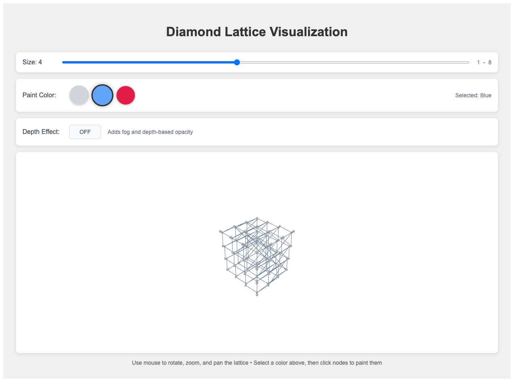

# 3D Go - Tetrahedral Lattice

A three-dimensional variant of the classic game Go, played on a tetrahedral lattice structure. Experience the ancient strategy game in a whole new dimension!



## 🎮 What is 3D Go?

This project reimagines the classic game of Go in three dimensions. Instead of placing stones on a flat 2D board, you play on a tetrahedral lattice - a 3D structure where each position connects to exactly four neighbors, maintaining the strategic essence of Go while adding spatial complexity.

The tetrahedral lattice topology is particularly interesting because it preserves many of the strategic properties of traditional Go better than a simple 3D grid would, as inner nodes maintain the characteristic four-neighbor connectivity.

## ✨ Features

### Game Modes
- **Explore Mode**: Free placement to learn the 3D board structure
- **vs Computer**: Play against AI opponents with varying difficulty levels
- **Challenge Mode**: Progressive difficulty with unlockable levels

### AI Opponents
- **Random**: Basic random stone placement
- **Attack**: Aggressive capture-focused strategy  
- **Greedy**: Territory-maximizing approach
- **Advanced**: Sophisticated multi-objective strategy

### Win Conditions
- **Capture 1 Stone**: Quick games for learning
- **Capture 3 Stones**: Medium-length strategic games
- **Territory + Captures**: Traditional Go scoring with territory control

### Interactive 3D Interface
- Smooth mouse controls for rotation, zoom, and pan
- Real-time stone placement and capture visualization
- Territory highlighting and score tracking
- Modern dark theme with clean Material-UI design

## 🚀 Getting Started

### Prerequisites
- Node.js (version 14 or higher)
- npm or nvm for package management

### Installation & Setup

1. **Clone the repository**
   ```bash
   git clone https://github.com/lukas/go-game.git
   cd go-game
   ```

2. **Start the game**
   ```bash
   ./start.sh
   ```

   The start script will automatically install dependencies and launch the development server at `http://localhost:5173`

### Alternative Commands

```bash
# Development server only
npm run dev

# Production build
npm run build

# Preview production build
npm run preview

# Run tests
npm run test
```

## 🎯 How to Play

### Basic Rules
1. **Stone Placement**: Click on any empty node to place your stone
2. **Capturing**: Surround enemy groups by removing all their liberties (adjacent empty spaces)
3. **Winning**: Achieve the selected win condition (captures or territory control)

### 3D Navigation
- **Rotate**: Click and drag to rotate the board
- **Zoom**: Scroll wheel to zoom in/out  
- **Pan**: Right-click and drag to pan the view

### Game Strategy
The 3D nature adds fascinating strategic depth:
- Multiple attack angles and defensive positions
- Complex territory shapes and boundaries
- Three-dimensional thinking required for optimal play

## 🛠️ Development

### Technology Stack
- **React 19** - Modern UI framework
- **Three.js + React Three Fiber** - 3D graphics and visualization
- **Material-UI** - Component library and theming
- **Vite** - Fast build tool and development server
- **Playwright** - End-to-end testing

### Project Structure
- `/src/App.jsx` - Main application with game state management
- `/src/components/TetrahedralLattice.jsx` - Core 3D game logic and rendering
- `/public/help.md` - In-game help content
- `/tests/` - Playwright end-to-end tests

### Contributing
1. Fork the repository
2. Create a feature branch
3. Make your changes
4. Run tests: `npm run test`
5. Submit a pull request

## 🧪 Testing

Run the comprehensive test suite:

```bash
# All tests
npm run test

# Headed mode (see browser)
npm run test:headed

# Interactive UI mode
npm run test:ui
```

## 📝 Game Rules & Strategy

The game follows traditional Go rules adapted for 3D:

- **Liberties**: Empty adjacent nodes (each node has exactly 4 neighbors)
- **Captures**: Groups with no liberties are removed
- **Territory**: Connected empty regions controlled by one player
- **Scoring**: Points for captured stones + controlled territory

The tetrahedral lattice creates unique strategic situations not found in 2D Go, making this both familiar and refreshingly challenging for Go players.

## 🎨 Credits

Created by [Lukas Biewald](https://github.com/lukas) using Claude Code for rapid development. The tetrahedral lattice concept was inspired by mathematician Henry Segerman.

## 📄 License

This project is open source. Feel free to explore, modify, and share!

## 🔗 Links

- [GitHub Repository](https://github.com/lukas/go-game)
- [Play Online](https://your-deployment-url.com) <!-- Update with actual deployment URL -->

---

Ready to experience Go in a whole new dimension? Install and start playing! 🚀